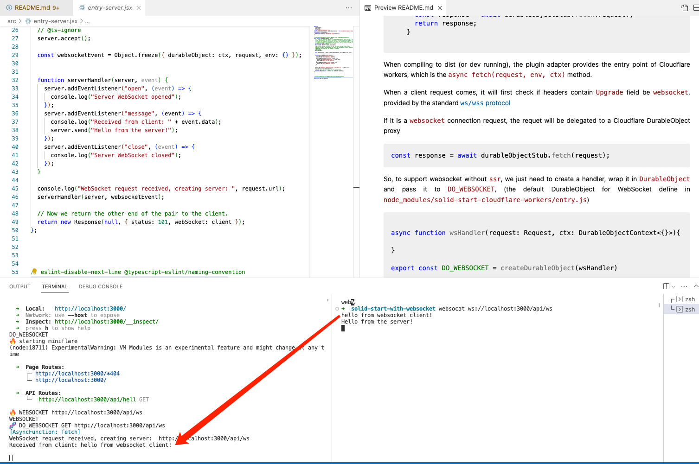

# SolidStart with WebSocket without SSR


SolidStart has experimental support for CloudFlare Websocket with DurableObjects. The example code provided by [the official repo](https://github.com/solidjs/solid-start/tree/main/examples/with-websocket) assumes SSR enabled in `vite.config.ts` by introducing SSR feature APIs like `server$`, as following:

```ts
// https://github.com/solidjs/solid-start/blob/main/examples/with-websocket/src/routes/index.tsx
const pingPong = createWebSocketServer(
  server$(function (webSocket) {
    webSocket.addEventListener("message", async msg => {
    ....
    });
  })
);
```

> The example code config **`ssr`** should be updated to **`true`** to successfully run the example. 

```ts
export default defineConfig({
plugins: [
    solid({
    ssr: false,
    experimental: {
        websocket: true
    }
    })
]
});
```

### However, in my case, I would like to support WebSocket without `SSR`. 


To deep dive into depent libs, 2 key packages are: 
* [solid-start/websocket](https://github.com/solidjs/solid-start/tree/main/packages/start/websocket) this is where solid-start add support for `createWebSocketServer` method above to create `SSR`-like handlers.


* [start-cloudflare-workers](https://github.com/solidjs/solid-start/tree/main/packages/start-cloudflare-workers) This is the SolidJS adapter for CloudFlare workers. The config is as: 

```ts
// vite.config.ts
import startCloudflareWorkers from "solid-start-cloudflare-workers";

export default defineConfig({
  envPrefix: "CLIENT_",
  plugins: [
    solid({
      ssr: true,
      experimental: {
        websocket: true
      },
      adapter: startCloudflareWorkers({
        durableObjectsPersist: true,
        kvPersist: false,
        // durableObjects: {
        //   db: "db",
        //   DO_WEBSOCKET: "DO_WEBSOCKET"
        // },
        async init(mf) {}
      })
    }),
```


### How `solid-start-cloudflare-workers` works
When compiled, this package inject the entry into final `dist/server.js`

```js
// node_modules/solid-start-cloudflare-workers/entry.js
export default {
  async fetch(request, env, ctx) {
    const url = new URL(request.url);
    const pathname = url.pathname;
    const clientAddress = request.headers.get("cf-connecting-ip");

    if (request.headers.get("Upgrade") === "websocket") {
      const durableObjectId = env.DO_WEBSOCKET.idFromName(url.pathname + url.search);
      const durableObjectStub = env.DO_WEBSOCKET.get(durableObjectId);
      const response = await durableObjectStub.fetch(request);
      return response;
    }

```

When compiling to dist (or dev running), the plugin adapter provides the entry point of Cloudflare workers, which is the `async fetch(request, env, ctx)` method.

When a client request comes, it will first check if headers contain `Upgrade` field be `websocket`, provided by the standard[ `ws/wss` protocol](https://developer.mozilla.org/en-US/docs/Web/HTTP/Protocol_upgrade_mechanism)

If it is a `websocket` connection request, the requet will be delegated to a Cloudflare DurableObject proxy
```js
const response = await durableObjectStub.fetch(request);
```

So, to support websocket without `ssr`, we just need to create a handler, wrap it in `DurableObject` and pass it to `DO_WEBSOCKET`, (the default DurableObject for WebSocket define in `node_modules/solid-start-cloudflare-workers/entry.js`)

```ts

async function wsHandler(request: Request, ctx: DurableObjectContext<{}>){

}

export const DO_WEBSOCKET = createDurableObject(wsHandler)
```

Done!

Check `entry-server.jsx` for detail. 


## Intro


Everything you need to build a Solid project, powered by [`solid-start`](https://start.solidjs.com);

## Creating a project

```bash
# create a new project in the current directory
npm init solid@latest

# create a new project in my-app
npm init solid@latest my-app
```

## Developing

Once you've created a project and installed dependencies with `npm install` (or `pnpm install` or `yarn`), start a development server:

```bash
npm run dev

# or start the server and open the app in a new browser tab
npm run dev -- --open
```

## Building

Solid apps are built with _adapters_, which optimise your project for deployment to different environments.

By default, `npm run build` will generate a Node app that you can run with `npm start`. To use a different adapter, add it to the `devDependencies` in `package.json` and specify in your `vite.config.js`.